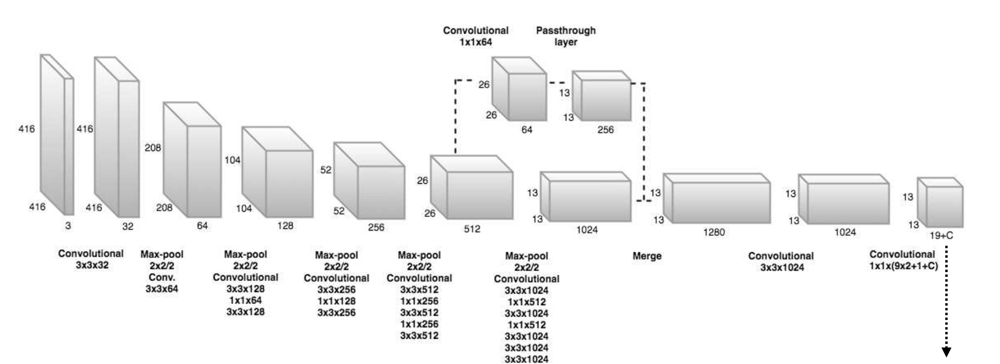
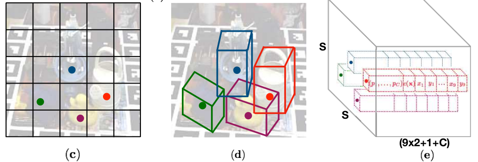
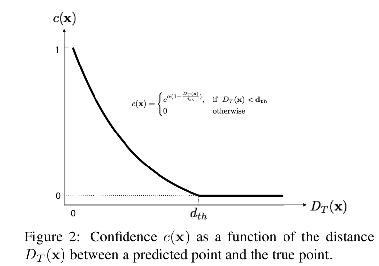
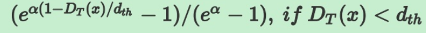
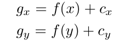
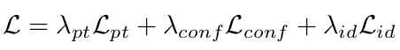
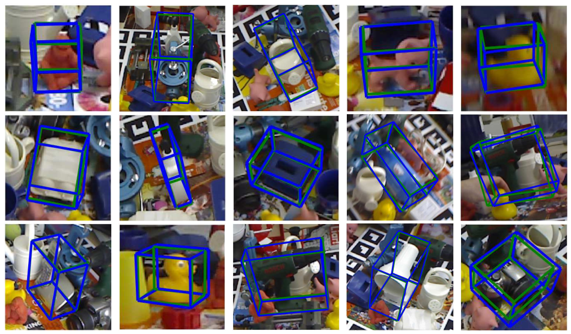
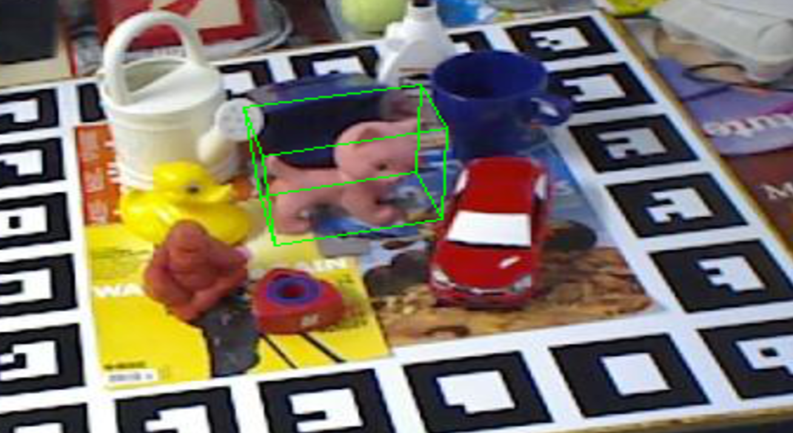
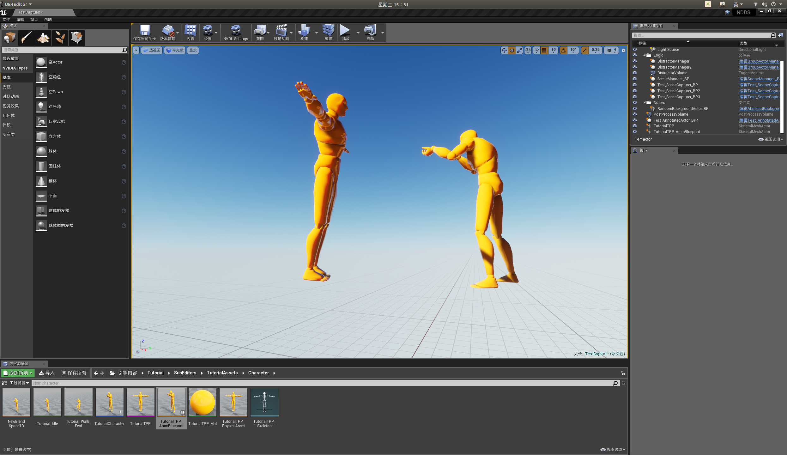

## 12.13

paper note: 
add pub key to github.com

## 12.14
install anaconda3 and cuda-11.1(not finished)
read the paper(Real-Time Seamless Single Shot 6D Object Pose Prediction)

paper简要概括：

整体思路：

将3D bouding box的8个corner和形心坐标投影到2D图像上，训练神经网络来预测这些在2D上的投影点，然后用pnp算法即可作出6D pose estimation。

网络结构：



将2D图片划分成SXS的网格，每个网格都负责预测物体类别以及bounding box的投影点，效果可以从下面图像直观看出：



​         yolo算法在2D框的预测中的置信度公式：`confidence = P(object)*IOU`，其中`P(object)`为预测的物体概率，`IOU`为预测2D框与真值2D框的重合度。yolo算法利用confidence来筛选预测的2D框。

confidence:        

 由于计算3D bounding box重合度花费时间较多，本文作者采用了取巧的方法，利用预测的2D投影点与真值之间的距离作为置信度函数，具体如下：



注：图中的`c(x)`的公式错误，应为

投影坐标：

与yolov2一样，文章不直接预测坐标，而是预测相对于网格的偏移量，对于8个角点不需要限制偏移量的范围，而中心（形心）点要约束在网格内，故其偏移量取值范围为0～1。公式如下：


其中，cx,cy为网格左上角的坐标，当x,y表示中心点时，f()为sigmoid函数，表示角点时，f()为单元函数（我理解为f(x) = x)

损失函数：



其中，Lpt，Lconf，Lid分别表示坐标，置信度和类别的损失。

最终效果：


## 12.15

system crashed and reinstalled it
use conda create a virtual env and install some packages

## 12.16
finish the configuration of the virtual environment
download the data needed for  test
test the single object recognition(the result in test_rest.dot)
valid_multi.py has some problem with loading weigts file etc
next few days I will go back to school for classes
when I go back to the lab, I will try to solve the loading problem.


## 12.21

完成了bounding box的绘制



## 12.22

本文数据集的标注

1. 获得3D bouding box  本文使用LINEMOD数据集提供的3D object model得到的
2. 定义3D bounding box的8个角和形心，8个corner的坐标为[[min_x, min_y, min_z], [min_x, min_y, max_z], [min_x, max_y, min_z], [min_x, max_y, max_z], [max_x, min_y, min_z], [max_x, min_y, max_z], [max_x, max_y, min_z], [max_x, max_y, max_z]]，形心坐标为[0,0,0]
3. 将3D关键点投影到2D，需要用到相机的内在校准矩阵，以及真实的旋转和平移。旋转和平移需要自己设法测量，文章作者给的提示参见这篇 [paper](http://cmp.felk.cvut.cz/~hodanto2/data/hodan2017tless.pdf)的3.1节，但感觉对无人机不适用
4. 计算围绕物体的2D rectangle box，本文通过拟合一个紧紧包含8个corner投影点的rectangle来获得2D box
5. 制作label。本文label长度为21，第一个是class label，后面9对是形心和8个corner的坐标，最后两个是x和y的变化范围（即坐标中最大值与最小值差）

### 12.30

思考的一些问题：

​       论文没有明确给出pnp算法所用到的坐标系，由于pnp算法需要用到三维空间中的真实坐标来估计相机的位姿，如果以大地（外界环境）作为世界系坐标，很难获得每张图片的关键点对应的3维坐标。如果以物体建立世界坐标系，那么就可以获得3维坐标了，这个可能是大家都默认的吧，很多博客上都没有指出世界坐标系是哪个，不过有几篇博客明确指出了世界坐标系是以物体建立的，这篇博客https://www.aiuai.cn/aifarm909.html是关于头部位置预测的，明确指出了世界坐标系的原点是鼻子。

另外，熟悉了下python对视频的处理，尝试从视频中逐帧识别，无法找到与论文训练集相关的视频，故只能用其数据集先进行视频的合成。

### 1.03

完成对合成视频的逐帧识别，但识别速度稍有下降，应该是在数据的传入花费时间相较之前时间长了点。

### 1.05

这两天在安装UE4和NDDS，准备看看能不能仿真一些数据出来，由于文件比较大，下载安装花的时间久了点。

安装UE4

```bash
git clone -b 4.21 https://github.com/EpicGames/UnrealEngine.git
cd UnrealEngine
# 注意不要用 root
./Setup.sh
./GenerateProjectFiles.sh
#执行完成后 目录下会有cmakelist 和 MakeFile 文件
#根据makefile里面的target 选择自己需要的内容进行编译 如下
make
```

安装NDDS：

```
下载git-lfs
解压
cd 到解压后的文件夹下
 $sudo ./install.sh
 
> Git LFS initialized

验证是否安装成功
$ git lfs install

> Git LFS initialized

 下载NDDS
$ git lfs clone -b v1.1 https://github.com/NVIDIA/Dataset_Synthesizer.git
双击Dataset_Synthesizer/Source路径下的NDDS.uproject，弹出Missing NDDS Modules时选择yes，等一会儿会自动打开UE4工程
```



安装成功，后面几天学校有课程安排，只能先看一些UE4的教程，熟悉下。