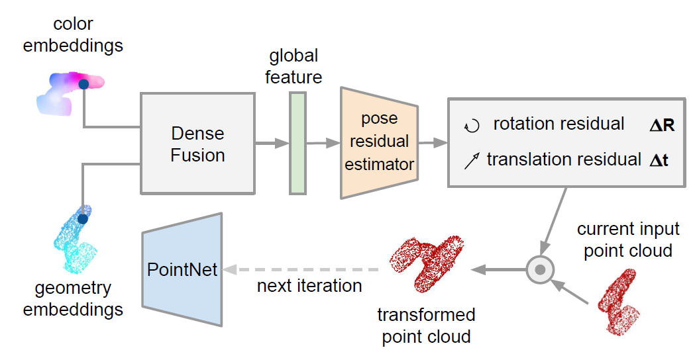
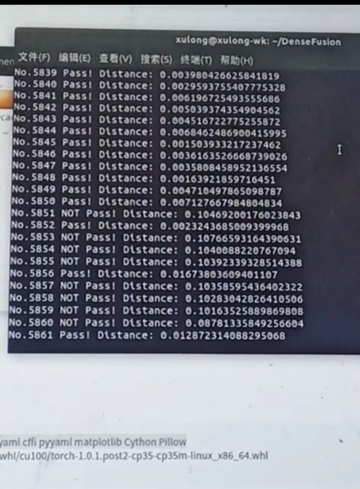
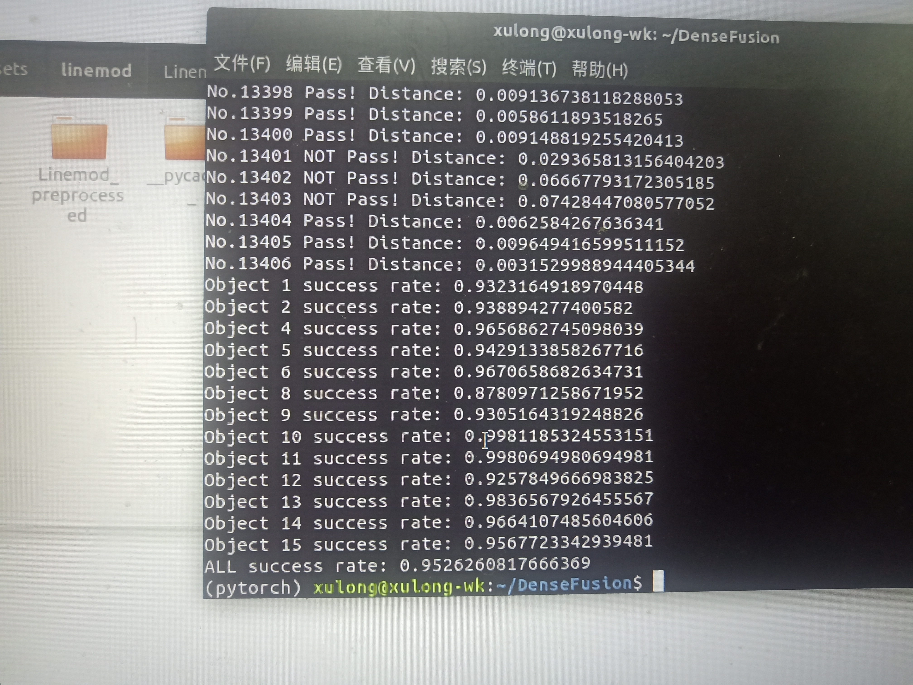
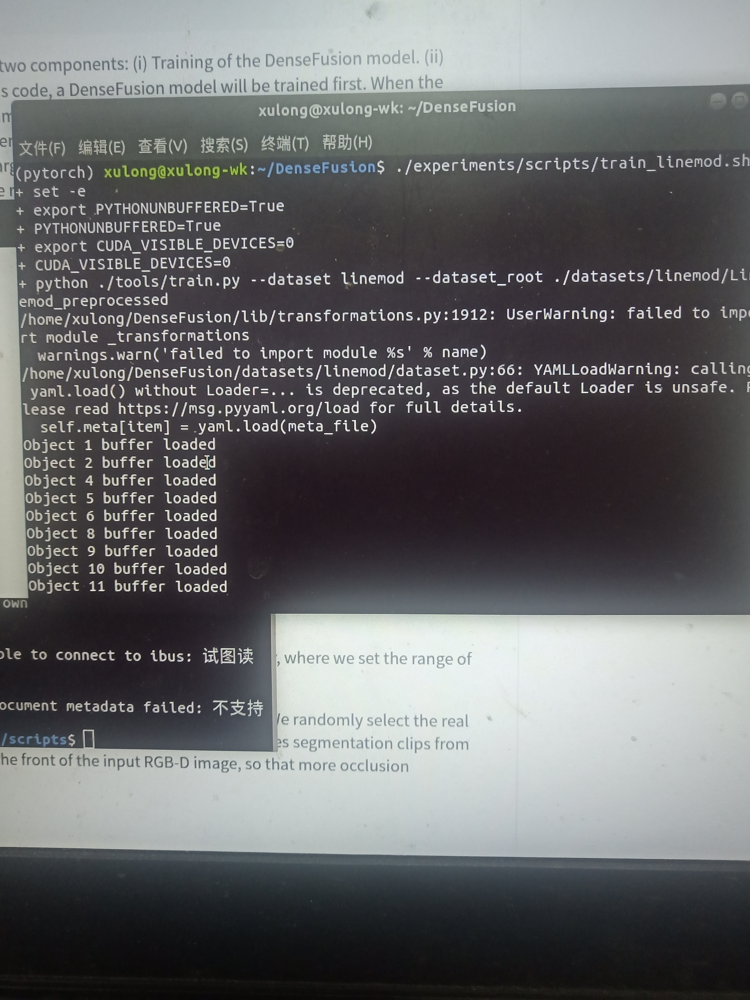
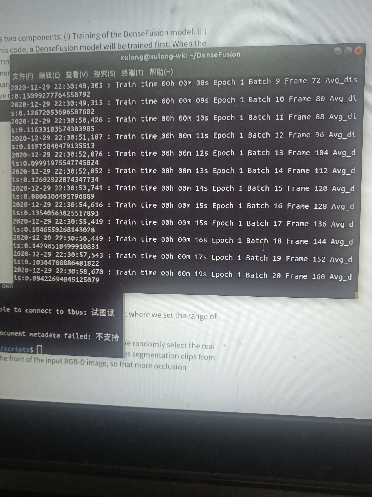

# 搞龙的工作记录

## 12.17

下载并阅读DenseFusion论文，论文笔记如下：

### 一、概要

DenseFusion的两大创新：

1.提出基于像素级的RGB和点云融合的6D位姿估计方法，改善以往算法在重度遮挡的情况下效果差的缺陷；

2.一个基于神经网络的迭代优化器，能改善以往算法利用后处理ICP导致实时性差的缺陷。

### 二、模型

主网络示意图如下：


#### （一）图像分割/目标检测

利用已有的目标检测网络，获取图像ROI，裁剪后输出。（利用已存在的6D位姿估计网络PoseCNN中的目标检测模块，是一种利用RGB信息的卷积神经网络）

#### （二）特征提取与融合

1.对于ROI的RGB信息，采用全卷积层（CNN），每一个像素对应一个RGB特征输出；

2.对于ROI的点云信息，采用基于PointNet的网络（将最大池化改成了平均池化），每一个像素对应一个几何特征输出；

3.分别将每个像素的RGB特征和几何特征做连接后，全部输入到一个“多层感知机+平均池化”网络，获得全局特征；

4.将获得的全局特征与每一个像素特征做连接，每个像素得到一个三段的特征。

#### （三）位姿估计与输出

参考了PointFusion的机制，一种从RGB信息和点云信息，像素级的3D对象检测模型。

1.将每个像素对应的特征输入到一个位姿估计网络，输出除了R、t外，还有该像素估计的置信度；

2.损失函数：

(1) 每个像素估计的损失分为不对称物体情况和对称物体情况，公式如下：
$$
L_i^p=\frac{1}{M}\sum\limits_{j}||(R_ix_j+t)-(\hat{R}_ix_j+\hat{t_i})||\ \ \ \ (不对称情况)
$$

$$
L_i^p=\frac{1}{M}\sum\limits_{j}\min\limits_{j\le k\le M}||(R_ix_j+t)-(\hat{R}_ix_k+\hat{t_i})||\ \ \ \ (对称情况)
$$

(2)总体损失将置信度和像素损失结合，训练的时候让置信度不能拉太低，公式如下：
$$
L=\frac{1}{N}\sum\limits_{i}(L_i^pc_i-wlog(c_i))
$$

#### （四）附网络

迭代优化器类似循环神经网络，示意图如下：



##### 1.位姿残差估计器

利用DenseFusion估计的结果对点云做变换，作为该网络的点云输入，RGB输入与DenseFusion输入相同。通过一个该网络，输出残差矩阵ΔR和Δt。对输入点云做变换后作为下一次该迭代过程的点云输入。

##### 2.注意事项

可以和主网络联合训练，但是一开始DenseFusion输出的噪声居多，使用时应当等DenseFusion收敛后再开始训练。结果上看，这个网络对准确率提高非常关键。

### 三、实验

用广泛数据集LineMOD和广泛的现有算法比较，用YCB-Video Dataset数据集展示模型抗遮挡能力和对不同纹理、形状对象的适用性。总的来说，效果很不错。


## 12.18

成功安装双系统（Ubuntu18.04），并成功安装英伟达显卡驱动。

### 注意事项：

Ubuntu18.04在分配空间的时候，保险起见，除了"\boot"外还得分配"\efi"，上述两个，我各分配的200M。前者作为启动导引器位置（但貌似没用？用efi就可以开机进bios选了）。

NVIDIA驱动直接进入设置界面，选择使用最新的驱动，自动安装。重启后进入MOK选择界面，再做相应设置即可，无需命令行禁止nouveau。


## 12.19

成功安装Cuda9.0和cuDNN7.6.5。

### 注意事项：

下载速度慢的情况下，建议翻墙。Ubuntu18.04装Cuda9.0要降级gcc，测试的时候不能忘记手动ldconfig添加动态链接库。


## 12.26

莫名奇妙地发现显卡驱动掉了，重装时候总是make报错，怀疑是gcc版本原因，在学长的帮助下重装显卡驱动，验证果然是gcc版本问题。遂决定卸载cuda9，直接安装cuda10。


## 12.27

### 配置环境

cuda10.0+cudnn7.6.5安装测试完毕。重新下载pytoch1.0.1，在墙外的速度以兆单位，很爽。pytorch-gpu安装测试完毕。cudnn测试又make错误，用上次韩志超学长的方法解决。

### 略读源码

从源码略读中，知道了一些网络的细节。

1. 点云中N数值为500（多的就随机删除了），与W×H的图像融合时，选择对应的500个点融合，如果W×H<500，用零填补。
2. 每一帧真正的点云信息获取依赖于数据集的第一帧图像点云
3. 颜色特征32维，几何特征3维（直接用的点云？）
4. 融合时，利用卷积+relu激活，获得颜色段128维，几何段256维，全局段1024维
5. target：第一帧点云通过变换来的；points：根据深度图和相机内参获得的
6. 优化器：target和points通过估计得到的Rt，反变换到相机坐标系原点后肯定是target更准确，因为他是标准的，points可能因分割或遮挡导致差错
7. 优化器几何输入的确是将points转为相机坐标系原点后作为输入。


## 12.29

在做完一堆准备工作后，下载Linemod数据集并进行测试。

### （一）Linemod数据集

- **data**
  - **01-15**
    - **depth(dir)：深度图，png文件**
    - **mask(dir)：标准分割结果，物体轮廓内为1，其他为0，png文件**
    - **rgb(dir)：RGB图像，png文件**
    - **gt.yml：拍摄每张图片时相机的R和t、目标物体的标准框、每张图片目标物体的类别**
    - **info.yml：拍摄每张图片时摄像头的内参和深度缩放的比例**
- **segnet_results**
  - **01-15_label(dir)：PoseCNN目标检测模块获得的分割结果，物体轮廓内为1，其他为0，png文件**
- **models**
  - **models_info.yml：每个目标点云模型的半径、xyz轴范围**
  - **obj_01-15.ply：以\data\xx\rgb\0000.png为基准的点云数据**

#### PS：

自己下载Linemod数据集等总是网络错误，在朱江超学长帮助下成功下载，怀疑是梯子不稳导致。

### （二）测试

- **代码：**

  - **所需输入：**数据根目录、主干网络模型、迭代优化器模型
  - **检测指标：**标准点云和相机获得点云转到当前相机坐标的平均距离，小于目标点云模型半径则合格
  - **输出结果：**日志文件和终端
    - 每张图片的测试通过与否和平均距离大小
    - 每个物体的检测通过率和整体通过率

- **坑与解决方案：**

  - **KNN：**由于作者编写了CUDA_KNN算法，不同环境.so文件和knn_pytorch.py需要重新获取：

    ```
    xulong@xulong-wk:~/densefusion/lib/knn$ python setup.py install
    xulong@xulong-wk:~/densefusion/lib/knn/dist$ unzip knn_pytorch-0.1-py3.5-linux-x86_64.egg
    ```

    还需将.so文件和knn_pytorch.py复制到对应目录。

  - **OpenCV：**由于OpenCV版本更新，findContours函数输出参数改变：

    ```
    #_, contours, _ = cv2.findContours(...)
    contours, _ = cv2.findContours(...)
    ```

    即将该函数输出的第一个参数删去。

- **运行图像：**

  执行脚本：

  ```
  ./experiments/scripts/eval_linemod.sh
  ```

  终端输出：

  




## 12.30

开始训练。

### （一）代码

- **搭建网络：**

  ```python
  estimator = PoseNet(num_points = opt.num_points, num_obj = opt.num_objects)
  refiner = PoseRefineNet(num_points = opt.num_points, num_obj = opt.num_objects)
  ```

- **加载数据：**

  ```python
  dataset = PoseDataset_linemod('train', opt.num_points, True, opt.dataset_root, opt.noise_trans, opt.refine_start)
  dataloader = torch.utils.data.DataLoader(dataset, batch_size=1, shuffle=True, num_workers=opt.workers)
  ```

- **循环迭代训练：**

  - **每轮过后判断主网是否抵达要求，达到则开始同时训练迭代优化器**

    ```python
    if best_test < opt.refine_margin and not opt.refine_start:
    ```

### （二）训练

执行脚本：

```
./experiments/scripts/train_linemod.sh
```

终端输出：





在训练到第六轮，准备同时训练迭代优化器时出错：

```python
RuntimeError: the derivative for 'index' is not implemented
```

原因是pytorch函数index_select函数版本问题：

```python
# lib/loss_refiner.py line45
# target = torch.index_select(target, 1, inds.view(-1) - 1)
target = torch.index_select(target, 1, inds.view(-1).detach() - 1)
```

此时训练中断，但不必回头重来，加载已经训练了一段时间的模型即可：

```python
python ./tools/train.py --dataset linemod --dataset_root ./datasets/linemod/Linemod_preprocessed --resume_posenet pose_model_current.pth
```

随后正常训练，进入漫长的等待环节。。。


## 01.02

训练到一半cuda掉了，重新来过。

深入阅读代码，了解其测试过程，并了解OpenCV基于视频流的检测原理，准备编写代码，将预测结果以点云重投影至图像的形式制作视频demo