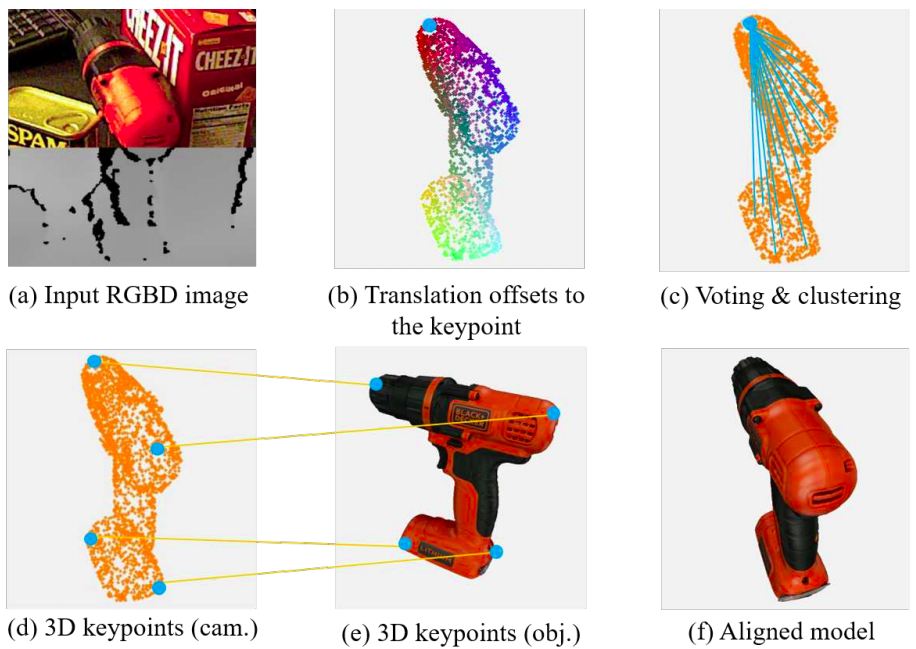
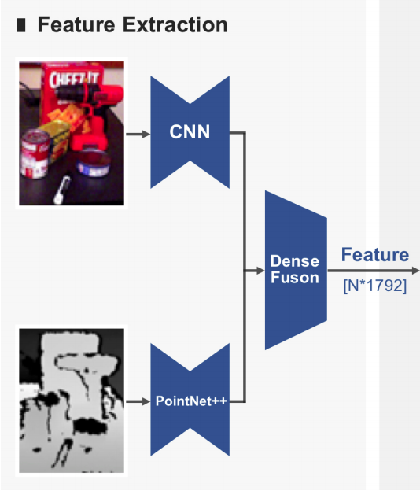
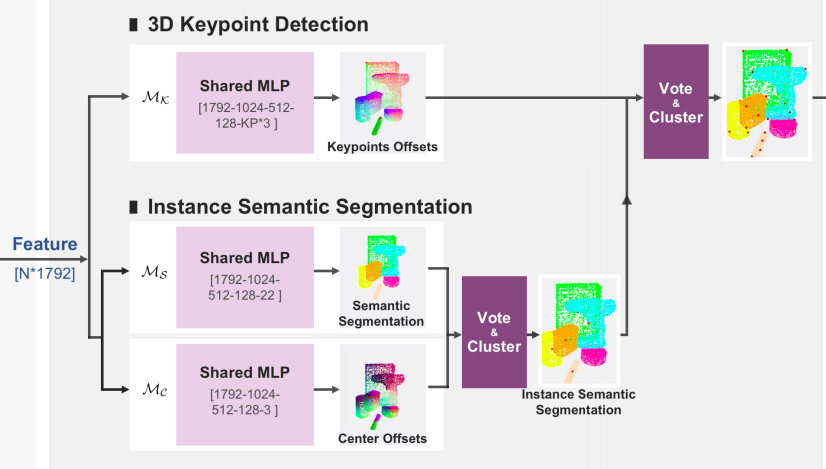
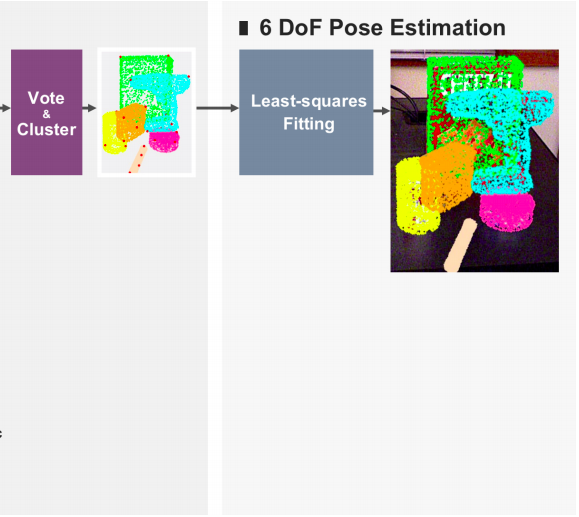
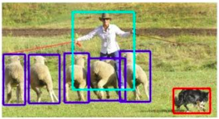
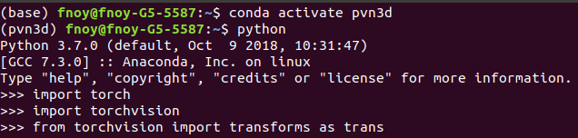
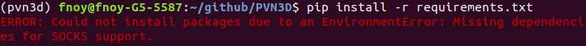
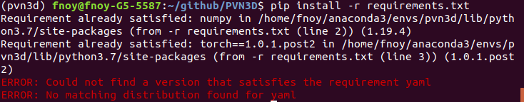
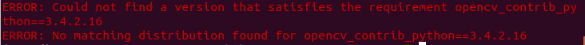

# 工作记录

## 12.20 

阅读论文

https://openaccess.thecvf.com/content_CVPR_2020/papers/He_PVN3D_A_Deep_Point-Wise_3D_Keypoints_Voting_Network_for_6DoF_CVPR_2020_paper.pdf

### 估算步骤

1. 输入RGBD图像(a)

2. 使用deep Hough voting network 来预测所选3D关键点的平移量(b)

3. 同一物体上的每一点对所选关键点进行投票并且聚类的中心被选为predicted keypoint(c)

4. 用最小二乘拟合方法估计6D位姿参数(d)-(e)

   




### 成果

在YCB （包含21个YCB对象）和LineMOD 数据集上表现卓越

建立了基于3D关键点的Hough voting network


### 实现细节

3D关键点提取










### 概念区分

instance semantic segmentation:


semantic segmentation


object localization



image classification

<<<<<<< HEAD


## 12.23

### 配置环境  install pytorch1.0.1 with python3.7,cuda9.0

昨天直接扒pytorch官网提供的命令

```
# CUDA 9.0
conda install pytorch==1.0.1 torchvision==0.2.2 cudatoolkit=9.0 -c pytorch
```

结果晚上9点半走的时候pytorch还没下载完，今天一看果然失败了。不知道为啥科学上网了还是慢得吓人

于是今天重新配环境

#### 首先添加镜像源

```
conda config --add channels http://mirrors.tuna.tsinghua.edu.cn/anaconda/pkgs/free/
conda config --add channels http://mirrors.tuna.tsinghua.edu.cn/anaconda/cloud/conda-forge 
conda config --add channels http://mirrors.tuna.tsinghua.edu.cn/anaconda/cloud/msys2/
conda config --set show_channel_urls yes
conda config --add channels https://mirrors.tuna.tsinghua.edu.cn/anaconda/cloud/pytorch/
```

#### 安装pytorch

后面不要添加-c pytorch，否则会从默认的地址下载pytorch，速度会很慢。

```
conda install pytorch==1.0.1 torchvision==0.2.2 cudatoolkit=9.0
```

运行下面的代码，没有报错就是安装成功了。

```
import torch
import torchvision
from torchvision import transforms as trans
```

又要去排练了，希望今天能好/(ㄒoㄒ)/~~


## 12.24

O(∩_∩)O~~今天成了！



 

### Install CUDA9.0

**报错1**



解决办法

```
unset all_proxy    
unset ALL_PROXY
pip install pysocks
source ~/.bashrc
```


**报错2**



解决办法

```
pip install pyyaml
```


**报错3**



解决办法

```
pip install 包名 -i http://pypi.douban.com/simple/ --trusted-host pypi.douban.com
```

#opencv_contrib_python==3.4.2.16

**失败！！！**


### pytorch1.5+cuda10.2

看到PVN3D github里提供了pytorch1.5的方案，遂弃暗投明（希望是明/(ㄒoㄒ)/~~）


通常，Ubuntu 18.04系统上安装的GCC和G++ 版本比较高，用下面的命令来查看电脑上的GCC和G++版本：

```
gcc --version
g++ --version
```

我的电脑上安装的版本是7.5，因此需手动降级

```
sudo apt-get install gcc-4.8
sudo apt-get install g++-4.8
cd /usr/bin
ls -l gcc*
```

对gcc和g++进行备份，并重新链接：

```
sudo mv gcc gcc.bak
sudo ln -s gcc-4.8 gcc
sudo mv g++ g++.bak
sudo ln -s g++-4.8 g++
```


=.= 今天废了 以上

=======

>>>>>>> 5dfa576268daa7cadc456741a80c1482ef47cedf
