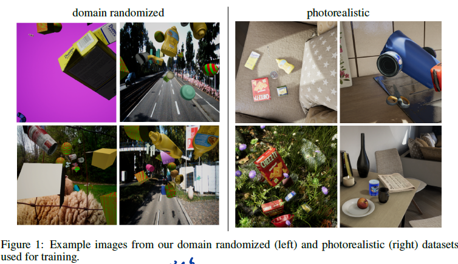

# Week 5 Progress

## 方法概述

##### 输入数据

RGB图像（不含深度信息，后续如果想添加深度图进行训练应该很简单）

##### 输出数据

置信度图（belief maps，8个3D边界框的顶点，1个形心，共9个）

向量场（vector fields，表示8个顶点其中之一指向其相应形心的方向，共8个，可以实现同一类型多个物体的检测（how?））。

##### 后续处理

1. 利用得到的置信度图，寻找阈值以上的局部极值，接着对于每个顶点，对该顶点处向量场评估的向量（描述顶点指向其形心的方向）和该顶点到每个形心的方向比较，将它分配给在一定阈值下最近的形心（a greedy assignment algorithm），这步获得了一个实例的**若干个**外接长方体的顶点。
2. 一旦每个物体的顶点都被确定，采用PnP算法获取物体的位姿（需要相机内参和物体尺寸），所有被检测到的顶点都会被用到（至少四个顶点被检测到）

##### 网络架构

具体结构：

1. the first ten layers from VGG-19（E型）

   

2. two 3\*3 convolution layers -> first stage: three 3\*3\*128 layers, one 1\*1\*512 layer, followed by either 1\*1\*9(belief maps) or a 1\*1\*16(vector fields) layer

3. The remaining five stages are identical to the first stage, except that they receive a 153-dimensional input (128+16+9 = 153) and consist of five 7\*7\*128 layers and one 1\*1\*128 layer before the 1\* 1 \* 9 or 1 \* 1 \*16 layer

#### 数据生成流程

核心：**全部使用虚拟生成数据**（synthetic data），**同时**使用**DR数据**（domain randomization）和**写实风格数据**（photorealistic images)。数据是用他们自己开发的虚幻4（Unreal Engine 4）的插件NDDS生成的。



Domain randomization: 在具有多种干扰物的随机背景上放置物体。图片很明显不是实拍，图片中不遵循物理规律。生成中使用了多种干扰物，纹理，背景，姿态、光照、噪声。

Photorealistic images: 把物体放置在具有物理约束的虚拟场景中，很像生活中实拍的照片；物体的遮挡、碰撞、下落都符合物理规律。物体允许在重力作用下下落或者与别的物体碰撞。


## 代码运行

### 安装

安装ROS Melodic，步骤省略

创建工作空间并编译

```bash
$ mkdir -p ~/dope_ws/src
$ cd ~/dope_ws/
$ catkin_make
```

克隆dope代码

```bash
$ cd ~/dope_ws/src
$ git clone https://github.com/NVlabs/Deep_Object_Pose.git dope
```

安装Python依赖

```bash
$ cd ~/dope_ws/src/dope
$ python3 -m pip install -r requirements.txt
```

其实这一步在安装conda之后已经做过了，为了防止Pytorch使用GPU出错，安装Pytorch和Cuda\Cudnn使用了Pytorch官网指定的命令。

安装ROS依赖

```bash
$ cd ~/dope_ws
$ rosdep install --from-paths src -i --rosdistro melodic
$ sudo apt-get install ros-melodic-rosbash ros-melodic-ros-comm
```

编译

```bash
$ cd ~/catkin_ws
$ catkin_make
```

### 运行

Start ROS master

```bash
$ cd ~/dope_ws
$ source devel/setup.bash
$ roscore
```

Start camera node

Open a new terminal

```bash
$ source devel/setup.bash
$ roslaunch dope camera.launch
```

### 报错

#### 报错1

如果没有在安装相应依赖的conda环境中，会报错：

```python
Traceback (most recent call last):
  File "/home/edward/dope_ws/src/dope/nodes/camera", line 11, in <module>
    import cv2
ModuleNotFoundError: No module named 'cv2'
```

切换到该环境中，报错

```python
Traceback (most recent call last):
  File "/home/edward/dope_ws/src/dope/nodes/camera", line 12, in <module>
    import cv2
ModuleNotFoundError: No module named 'rospkg'
```

尝试使用pip安装，现有源里无法定位包；考虑到已经安装了完整版ROS，可能是因为Conda环境将虚拟环境和系统中的ROS包隔离的原因导致找不到包，查找到[解决方法](https://blog.csdn.net/m0_37579176/article/details/86536411)

```bash
$ conda install setuptools
$ pip install -U rosdep rosinstall_generator wstool rosinstall six vcstools
```

以上两行代码都在虚拟环境中运行。运行之后，相应的虚拟环境也可以调用相关的ROS包。

#### 报错2

第12行没有继续报错，似乎表明解决方案可行；

出现新错误：

```python
Traceback (most recent call last):
  File "/home/edward/dope_ws/src/dope/nodes/camera", line 13, in <module>
    from camera_info_manager import CameraInfoManager
ModuleNotFoundError: No module named 'camera_info_manager'
```

搜索，有博客认为应该安装该包：

```bash
$ sudo apt-get install ros-melodic-camera-info-manager
```

输入命令，显示该包已经为最新版本。查询ROS文档，发现camera_info_manager是当作一个C++的接口介绍的

> This package contains no ROS nodes or utility commands.
>
> It provides a C++ class used by many camera drivers to manage the [camera calibration data](http://wiki.ros.org/image_pipeline/CameraInfo) required by the [ROS image pipeline](http://wiki.ros.org/image_pipeline).
>
> For camera drivers written in Python, the [camera_info_manager_py](http://wiki.ros.org/camera_info_manager_py) package provides a similar interface.

推测此处camera_info_manager所属的包其实应该是ros-melodic-camera-info-manager-py，输入命令

```bash
$ sudo apt-get install ros-melodic-camera-info-manager-py
```

安装后该行不再报错。

#### 报错3

再次尝试运行

```bash
$ roslaunch dope camera.launch
```

报错：

```python
Traceback (most recent call last):
  File "/home/edward/dope_ws/src/dope/nodes/camera", line 73, in <module>
    publish_images()
  File "/home/edward/dope_ws/src/dope/nodes/camera", line 59, in publish_images
    image = CvBridge().cv2_to_imgmsg(frame, "bgr8")
  File "/opt/ros/melodic/lib/python2.7/dist-packages/cv_bridge/core.py", line 259, in cv2_to_imgmsg
    if self.cvtype_to_name[self.encoding_to_cvtype2(encoding)] != cv_type:
  File "/opt/ros/melodic/lib/python2.7/dist-packages/cv_bridge/core.py", line 91, in encoding_to_cvtype2
    from cv_bridge.boost.cv_bridge_boost import getCvType
ImportError: dynamic module does not define module export function (PyInit_cv_bridge_boost)
```

疯狂搜索后找到对应[解决方法](https://stackoverflow.com/questions/49221565/unable-to-use-cv-bridge-with-ros-kinetic-and-python3?rq=1)：

与推测的相同，从Traceback中可以看出出错的是ROS的lib里带的Python包中，该包对应的版本是Python2.7，而dope代码是在ROS noetic上测试的，noetic是第一个支持python3的版本，所以应该是一个版本不匹配的问题。所以需要用python3重新编译这个包。

```bash
# `python-catkin-tools` is needed for catkin tool
# `python3-dev` and `python3-catkin-pkg-modules` is needed to build cv_bridge
# `python3-numpy` and `python3-yaml` is cv_bridge dependencies
# `ros-kinetic-cv-bridge` is needed to install a lot of cv_bridge deps. Probaply you already have it installed.
sudo apt-get install python-catkin-tools python3-dev python3-catkin-pkg-modules python3-numpy python3-yaml ros-melodic-cv-bridge
# Create catkin workspace
mkdir catkin_workspace
cd catkin_workspace
catkin init
# Instruct catkin to set cmake variables
catkin config -DPYTHON_EXECUTABLE=/usr/bin/python3 -DPYTHON_INCLUDE_DIR=/usr/include/python3.6m -DPYTHON_LIBRARY=/usr/lib/x86_64-linux-gnu/libpython3.6m.so
# Instruct catkin to install built packages into install place. It is $CATKIN_WORKSPACE/install folder
catkin config --install
# Clone cv_bridge src
git clone https://github.com/ros-perception/vision_opencv.git src/vision_opencv
# Find version of cv_bridge in your repository
apt-cache show ros-melodic-cv-bridge | grep Version
    Version: 1.13.0-0bionic-"一串数字，没有记住"
# Checkout right version in git repo. In our case it is 1.12.8
cd src/vision_opencv/
git checkout 1.13.0
cd ../../
# Build
catkin build cv_bridge
# Extend environment with new package
source install/setup.bash --extend
```

需要注意，以上所有涉及ROS版本都要替换为电脑上对应的版本，Python版本也要与电脑上的对应。电脑上的Python版本可以在终端中输入python3检查（注意退出所有虚拟环境）。

#### 报错4

尝试启动dope节点

```bash
$ roslaunch dope dope.launch
```

报错

```python
Traceback (most recent call last):
  File "/home/edward/dope_ws/src/dope/nodes/dope", line 19, in <module>
    import tf.transformations
  File "/opt/ros/melodic/lib/python2.7/dist-packages/tf/__init__.py", line 30, in <module>
    from tf2_ros import TransformException as Exception, ConnectivityException, LookupException, ExtrapolationException
  File "/opt/ros/melodic/lib/python2.7/dist-packages/tf2_ros/__init__.py", line 38, in <module>
    from tf2_py import *
  File "/opt/ros/melodic/lib/python2.7/dist-packages/tf2_py/__init__.py", line 38, in <module>
    from ._tf2 import *
ImportError: dynamic module does not define module export function (PyInit__tf2)
```

问题应该与之前类似，需要用python3重新编译，[方法见此](https://answers.ros.org/question/326226/importerror-dynamic-module-does-not-define-module-export-function-pyinit__tf2/)


### 正常运行流程

打开终端1：

```bash
$ roscore
```

打开终端2：

```bash
$ conda activate dope_env
$ source ~/dope_ws/devel/setup.bash
$ source ~/catkin_workspace/install/setup.bash --extend
$ cd ~/dope_ws
$ roslaunch dope camera.launch
```

打开终端3：

```bash
$ conda activate dope_env
$ source ~/dope_ws/devel/setup.bash
$ source ~/tf2_ws/devel/setup.bash --extend
$ source ~/catkin_workspace/install/setup.bash --extend
$ cd ~/dope_ws
$ roslaunch dope dope.launch
```

摄像头指示灯亮起，如果此时config_pose.yaml中配置要检测的物体的响应权重weights文件夹中没有，会有类似以下报错

```
ERROR:  Unable to find model weights: '/home/edward/dope_ws/src/dope/weights/soup_60.pth'
```

打开终端4：

```bash
$ rosrun rviz rviz
```

添加Image，如果摄像头输入图像中有要检测的物体，会画出它的外接长方体。


## 梳理

工作空间的覆盖

ROS允许多个工作空间并存，当设置多个时，后设置的会自动放在最前端；在运行时，ROS 会优先查找最前端的工作空间中是否存在指定的包，如果不存在，就顺序向后查找其他工作空间。

可以通过以下命令查看所有ROS相关的环境变量，其中包括ROS_PACKAGE_PATH. 目录之间用:隔开。

```bash
$ env | grep ros
```

返回如下：

```
...
ROS_PACKAGE_PATH=/home/edward/dope_ws/src:/home/edward/catkin_ws/src:/opt/ros/melodic/share
...
```