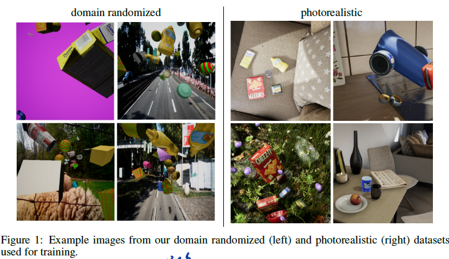
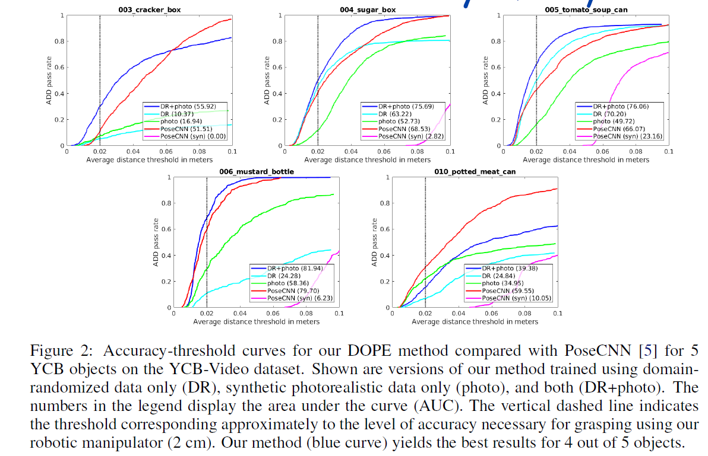

# Week 4 Progress

## 系统、软件、环境配置

### 安装Ubuntu 20.04

1. 机型OMEN15（中文：暗影精灵6），可能因为显卡原因必须切换为**混合模式**（相对于直连模式）才能顺利进入安装界面，否则安装时会出现花屏。实测安装时无需关闭Secure Boot（安全启动），关闭也可正常安装。（直连模式可以安装16.04，但无法安装18.04和20.04版本）
2. 管理磁盘，留出未分配的空间（约320G）用于安装Ubuntu系统。
3. 下载 Ubuntu 20.04.1 (Focal Fossa），使用软碟通导入硬盘映像制作启动盘；
4. 进入BIOS修改启动顺序，优先USB disk启动。
5. 进入Ubuntu安装界面，minimal installation, 手动分区如下：EFI 200M Primary, swap 32G Primary, \ 30G logical, \usr 130G logical, \home 130G logical.
6. 等待安装完成

### 安装ROS Noetic

在Thinkpad-E580上顺利安装，但在OMEN15上总出现如下问题：

```bash
下列软件包有未满足的依赖关系：
ros-noetic-desktop-full : 依赖: ros-noetic-desktop 但是它将不会被安装
 
    依赖: ros-noetic-perception 但是它将不会被安装
 
    依赖: ros-noetic-simulators 但是它将不会被安装
 
    依赖: ros-noetic-urdf-sim-tutorial 但是它将不会被安装
E: 无法修正错误，因为您要求某些软件包保持现状，就是它们破坏了软件包间的依赖关系。
```

网上查询后发现依赖问题一般出现在已经安装过ROS后卸载的情况，可以安装aptitude再用aptitude进行自适应安装来解决，但这台电脑以前并没有安装过ROS，使用aptitude后发现数目巨大的包都出现依赖问题，多次重装并试验、查询后猜测是更新导致（https://blog.csdn.net/u013013023/article/details/108298086）。

重新安装Ubuntu，安装成功点击“Done"后不进行任何设置，不换源，不执行`` sudo apt-get upgrade``直接按照官方教程安装ROS，成功安装；再执行

```bash
sudo apt-get install python3-rosdep
```

此时可以顺利执行turtlesim程序。

### 其他配置

在软件与更新中安装NVIDIA显卡驱动（如果Secure Boot开启，需要根据提示设置MOK密码并在下次开机时输入），安装git、typora。

相关教程：

安装Ubuntu：https://www.cnblogs.com/masbay/p/10745170.html

卸载Ubuntu：https://www.jianshu.com/p/42af78f88962

安装ROS：http://wiki.ros.org/noetic/Installation/Ubuntu

出现问题类似：https://blog.csdn.net/u013013023/article/details/108298086（出现问题相似，但不需要模仿其解决方法，似乎重装后直接安装即可）


## 论文阅读

Github项目地址：https://github.com/NVlabs/Deep_Object_Pose

论文地址：https://arxiv.org/abs/1809.10790

### 主要思想/结论

设计了一种用来检测和估计已知物体的六维位姿的**新型架构神经网络**和**数据生成流程**

#### 新型网络架构

输入数据为RGB图像（不含深度信息），输出为置信度图（belief maps，8个3D边界框的顶点，1个形心，共9个）和向量场（vector fields，表示8个顶点其中之一指向其相应形心的方向，共8个，可以实现同一类型多个物体的检测）。

具体结构：the first ten layers from VGG-19 -> two 3\*3 convolution layers -> first stage: three 3\*3\*128 layers, one 1\*1\*512 layer, followed by either 1\*1\*9(belief maps) or a 1\*1\*16(vector fields) layer -> The remaining five stages are identical to the first stage, except that they receive a 153-dimensional input (128+16+9 = 153) and consist of five 7\*7\*128 layers and one 1\*1\*128 layer before the 1\* 1 \* 9 or 1 \* 1 \*16 layer (?最后这句具体含义存疑)

随后是位姿估计阶段，利用得到的置信度图，寻找阈值以上的局部极值，接着对于每个顶点，对该顶点的向量场和该顶点到每个形心的方向比较，将它分配给在一定阈值下最近的形心；一旦每个物体的顶点都被确定，采用PnP算法获取物体的位姿（需要相机内参和物体维度），所有顶点都会用到（至少四个顶点被检测到）。

#### 数据生成流程

核心：**全部使用虚拟生成数据**（synthetic data），**同时**使用**DR数据**（domain randomization）和**写实风格数据**（photorealistic images)。数据是用他们自己开发的虚幻4（Unreal Engine 4）的插件NDDS生成的。



Domain randomization: 在具有多种干扰物的随机背景上放置物体。图片很明显不是实拍，图片中不遵循物理规律。

Photorealistic images: 把物体放置在具有物理约束的虚拟场景中，很像生活中实拍的照片；物体的遮挡、碰撞、下落都符合物理规律。

### 实验结果



如图，相比poseCNN（用真实数据和生成数据训练），DOPE的结果相当或者更好，但poseCNN完全使用虚拟生成数据效果是很差的；DOPE单独使用DR数据或写实数据的效果明显不如同时使用两种数据训练。

在要求物体边缘估计误差不超过两个厘米的机器人操作实验时，DOPE表现不错，说明这个模型可以用于实践。

### 存疑部分

这种方法的显著优势在于完全使用虚拟生成数据的便捷性，但对于无人机场景下的有效性还不太清楚：

- 这个方案只用RGB图像作为输入，没有考虑深度信息，因此在效果上是否很难与考虑深度的方法相比？~~[6D Pose Estimation](https://paperswithcode.com/task/6d-pose-estimation-1/latest)网站上YCB数据集的排名也没有看到这种方法；~~
- 使用写实生成数据时

> Azimuth ranged from –120° to +120° (to avoid collision with the wall, when present), elevation from 5° to 85° and distance from 0.5 m to 1.5 m.

生成的物体距离只在1.5m内，似乎对多无人机飞行场景有点近了？

- 论文里试验的数据都是罐头与盒子，本身形态和立方体比较接近，对于无人机这种本身形状和立方体不接近的情况会不会对识别结果有影响？方法可能需要作哪些调整？

